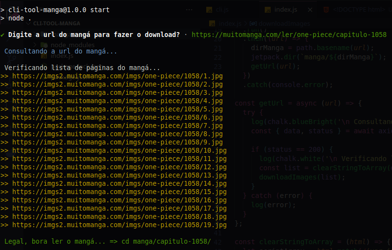

# cli-tool-manga

Cli tool para fazer o download de mangá.

### Tecnologias utilizadas no projeto;

- NodeJs [Site](https://nodejs.org/en/)
- Enquirer [Github](https://github.com/enquirer/enquirer)
- Chalk [Github](https://github.com/chalk/chalk)
- Fs-jetpack [Github](https://github.com/szwacz/fs-jetpack)
- Axios [Github](https://github.com/axios/axios)

### Start do projeto

```shell
npm install && npm start

```

### Imagens


